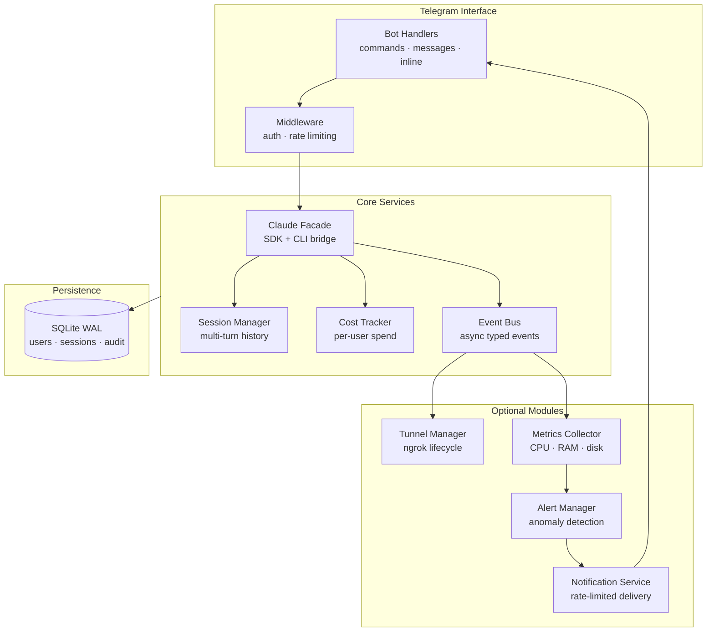

<div align="center">

# 🤖 claude-remote-bot

**Control Claude Code from anywhere — via Telegram.**

[](CHANGELOG.md)
[](https://python.org)
[](LICENSE)
[](https://github.com/sudohakan/claude-remote-bot/actions)
[](https://github.com/sudohakan/claude-remote-bot/stargazers)

[Quick Start](#-quick-start) · [Features](#-features) · [Architecture](#-architecture) · [Commands](#-commands) · [Configuration](#-configuration) · [Contributing](#-contributing)

</div>

---

## What is this?

A production-ready Telegram bot that gives you secure, multi-user remote access to Claude Code. Send messages from your phone, get AI responses back. Manage SSH tunnels, monitor your system, upload files for analysis — all from Telegram.

Built on Python 3.12+ with [python-telegram-bot 22](https://github.com/python-telegram-bot/python-telegram-bot) and the [Claude Agent SDK](https://github.com/anthropics/claude-code).

---

## ✨ Features

| Feature | Details |
|:--------|:--------|
| **Claude integration** | SDK-first with automatic CLI fallback; agentic multi-turn mode |
| **Multi-user auth** | Invite-token system with admin / user / viewer roles |
| **SSH tunnel** | ngrok lifecycle management with auto-restart and admin alerts |
| **System monitor** | CPU/RAM/disk metrics, SSH session counting, anomaly alerts |
| **File uploads** | Send code, archives (zip/tar), and images for Claude analysis |
| **Git integration** | Safe read-only git operations within approved directories |
| **Session export** | Export chat history as Markdown, JSON, or HTML |
| **Quick actions** | Context-aware inline keyboard shortcuts |
| **WSL watchdog** | PowerShell watchdog restarts the bot if WSL dies |
| **Anti-spam** | State-change-only notifications, dedup windows, configurable hourly reports |

---

## 🚀 Quick Start

**Three steps to a running bot:**

**1. Create a bot and get your credentials**

Message [@BotFather](https://t.me/BotFather) on Telegram → `/newbot` → copy the token.
Get your own Telegram user ID from [@userinfobot](https://t.me/userinfobot).

**2. Clone and configure**

```bash
git clone https://github.com/sudohakan/claude-remote-bot.git
cd claude-remote-bot
cp .env.example .env
# Edit .env — set TELEGRAM_BOT_TOKEN and ADMIN_TELEGRAM_ID at minimum
```

**3. Install and start**

```bash
bash scripts/install.sh
```

The install script installs dependencies, initializes the SQLite database, creates a systemd user service, and registers the Windows Task Scheduler watchdog if PowerShell is available.

---

## 📦 Installation

<details>
<summary><strong>Automated install (recommended)</strong></summary>

```bash
bash scripts/install.sh
```

What it does:
1. Installs Python dependencies via `pip install -e .`
2. Initializes the SQLite database at `data/bot.db`
3. Creates and enables a `systemd --user` service
4. Registers `scripts/wsl-watchdog.ps1` in Windows Task Scheduler (if PowerShell detected)

</details>

<details>
<summary><strong>Manual install</strong></summary>

```bash
# Install dependencies
pip install -e .

# Start directly
python3 -m src.main

# Or use the run script
bash scripts/run-bot.sh
```

</details>

<details>
<summary><strong>Development install</strong></summary>

```bash
pip install -e ".[dev]"
```

Includes: `pytest`, `pytest-asyncio`, `pytest-cov`, `pytest-mock`, `black`, `isort`, `flake8`, `mypy`.

</details>

<details>
<summary><strong>Service management (systemd)</strong></summary>

```bash
systemctl --user status claude-remote-bot
systemctl --user start claude-remote-bot
systemctl --user stop claude-remote-bot
systemctl --user restart claude-remote-bot
journalctl --user -u claude-remote-bot -f
```

</details>

---

## 🏗 Architecture



<details>
<summary><strong>Project structure</strong></summary>

```
claude-remote-bot/
├── src/
│   ├── main.py             # Entry point — wires all services
│   ├── bot/                # Telegram handlers, middleware, features
│   ├── claude/             # SDK + CLI bridge, session management, cost tracking
│   ├── config/             # Pydantic settings, feature flags
│   ├── events/             # Async event bus + typed events
│   ├── monitor/            # psutil metrics collector, reporter, anomaly alerts
│   ├── notifications/      # Rate-limited, dedup-aware notification delivery
│   ├── security/           # Invite auth, rate limiter, path validator, audit log
│   ├── storage/            # SQLite (WAL mode) + repositories
│   └── tunnel/             # ngrok lifecycle manager + admin notifier
├── tests/                  # pytest test suite (8 test files)
├── scripts/
│   ├── install.sh          # Full automated setup
│   ├── run-bot.sh          # Simple run script
│   └── wsl-watchdog.ps1    # Windows Task Scheduler watchdog
├── data/                   # Runtime data (db, metrics, tunnel state)
├── pyproject.toml
└── .env.example
```

</details>

---

## 🔧 Configuration

All settings are loaded from `.env`. Copy `.env.example` to get started.

<details open>
<summary><strong>Required variables</strong></summary>

| Variable | Required | Default | Description |
|:---------|:--------:|:-------:|:------------|
| `TELEGRAM_BOT_TOKEN` | Yes | — | Bot token from [@BotFather](https://t.me/BotFather) |
| `ADMIN_TELEGRAM_ID` | Yes | — | Your Telegram user ID |

</details>

<details>
<summary><strong>Claude / Anthropic</strong></summary>

| Variable | Required | Default | Description |
|:---------|:--------:|:-------:|:------------|
| `ANTHROPIC_API_KEY` | No | — | Anthropic API key. Falls back to `claude` CLI if unset |
| `CLAUDE_MODEL` | No | SDK default | Model override (e.g. `claude-opus-4-5`) |
| `CLAUDE_MAX_TURNS` | No | `10` | Max agentic turns per request |
| `CLAUDE_TIMEOUT_SECONDS` | No | `120` | Per-request timeout |
| `CLAUDE_MAX_COST_PER_USER` | No | `5.0` | Monthly cost cap per user (USD) |
| `CLAUDE_MAX_COST_PER_REQUEST` | No | `1.0` | Per-request cost cap (USD) |
| `AGENTIC_MODE` | No | `true` | Enable multi-turn agentic execution |

</details>

<details>
<summary><strong>Storage & sessions</strong></summary>

| Variable | Required | Default | Description |
|:---------|:--------:|:-------:|:------------|
| `DATABASE_URL` | No | `sqlite:///data/bot.db` | SQLite database path |
| `SESSION_TIMEOUT_HOURS` | No | `24` | Idle session expiry |

</details>

<details>
<summary><strong>Rate limiting</strong></summary>

| Variable | Required | Default | Description |
|:---------|:--------:|:-------:|:------------|
| `RATE_LIMIT_CLAUDE_PER_MIN` | No | `20` | Max Claude requests per minute per user |
| `RATE_LIMIT_COMMANDS_PER_MIN` | No | `5` | Max bot commands per minute per user |
| `RATE_LIMIT_INVITES_PER_HOUR` | No | `3` | Max invite tokens generated per hour |

</details>

<details>
<summary><strong>SSH tunnel (ngrok)</strong></summary>

| Variable | Required | Default | Description |
|:---------|:--------:|:-------:|:------------|
| `ENABLE_TUNNEL` | No | `false` | Enable ngrok tunnel manager |
| `NGROK_AUTHTOKEN` | No | — | ngrok auth token (required if tunnel enabled) |
| `SSH_PORT` | No | `22` | Local SSH port to expose |
| `TUNNEL_POLL_INTERVAL_SECONDS` | No | `30` | How often to check tunnel health |
| `TUNNEL_MAX_RETRIES` | No | `5` | Restart attempts before giving up |

</details>

<details>
<summary><strong>System monitor</strong></summary>

| Variable | Required | Default | Description |
|:---------|:--------:|:-------:|:------------|
| `ENABLE_MONITOR` | No | `true` | Enable system metrics collector |
| `MONITOR_COLLECT_INTERVAL_SECONDS` | No | `60` | Metrics collection interval |
| `HOURLY_REPORT_ENABLED` | No | `false` | Enable scheduled hourly reports |
| `ALERT_CPU_PERCENT` | No | `90` | CPU alert threshold |
| `ALERT_RAM_PERCENT` | No | `85` | RAM alert threshold |
| `ALERT_DISK_PERCENT` | No | `90` | Disk alert threshold |
| `ALERT_SSH_FAILURES_PER_MIN` | No | `5` | SSH failure rate alert |

</details>

<details>
<summary><strong>Feature flags</strong></summary>

| Variable | Required | Default | Description |
|:---------|:--------:|:-------:|:------------|
| `ENABLE_FILE_UPLOADS` | No | `true` | Allow file uploads to Claude |
| `ENABLE_GIT_INTEGRATION` | No | `true` | Enable read-only git commands |
| `ENABLE_API_SERVER` | No | `false` | Enable FastAPI HTTP server |
| `API_SERVER_PORT` | No | `8080` | API server port |
| `ENABLE_VOICE_MESSAGES` | No | `false` | Voice message processing |
| `LOG_LEVEL` | No | `INFO` | Logging level |
| `DEBUG` | No | `false` | Debug mode |

</details>

---

## 💬 Commands

<details open>
<summary><strong>All users</strong></summary>

| Command | Description |
|:--------|:------------|
| `/start [token]` | Start the bot or redeem an invite token |
| `/help` | Show available commands |
| `/ping` | Check bot is alive |
| `/new` | Start a new Claude session |
| `/status` | Current system status (CPU, RAM, disk) |
| `/ssh` | SSH tunnel info and connection details |
| `/history` | Recent command history |
| `/about` | Bot info and architecture overview |

</details>

<details>
<summary><strong>Admin only</strong></summary>

| Command | Description |
|:--------|:------------|
| `/invite` | Generate an invite token |
| `/users` | List all registered users |
| `/stats` | 24-hour system statistics |
| `/alerts [on\|off]` | Toggle hourly system reports |
| `/broadcast <msg>` | Send a message to all users |
| `/tunnel restart` | Force-restart ngrok tunnel |
| `/sessions` | List active Claude sessions |

</details>

---

## 🔒 Security Model

<details>
<summary><strong>Authentication layers</strong></summary>

**Invite-token auth** — Users must redeem a single-use invite token (generated by admin via `/invite`) before the bot responds. No token = no access.

**Role hierarchy:**
- `admin` — Full access, generated at bot start from `ADMIN_TELEGRAM_ID`
- `user` — Can chat with Claude, view status, manage own sessions
- `viewer` — Read-only access (status, history)

**Audit log** — All commands and Claude interactions are written to the SQLite audit table with timestamp, user ID, and action.

</details>

<details>
<summary><strong>Rate limiting</strong></summary>

Three independent rate limits enforced per-user:
- Claude requests: `RATE_LIMIT_CLAUDE_PER_MIN` (default 20/min)
- Bot commands: `RATE_LIMIT_COMMANDS_PER_MIN` (default 5/min)
- Invite generation: `RATE_LIMIT_INVITES_PER_HOUR` (default 3/hour)

Limits are tracked in-memory with sliding windows.

</details>

<details>
<summary><strong>Path safety</strong></summary>

The git integration enforces a path validator that restricts all file operations to an approved directory allowlist. No directory traversal, no symlink escapes.

</details>

<details>
<summary><strong>Credential sanitizer</strong></summary>

All Claude output passes through `CredentialSanitizer` before being sent to Telegram. Patterns matched: AWS keys, GitHub tokens, OpenAI keys, private key blocks, and common secret formats.

</details>

<details>
<summary><strong>Cost controls</strong></summary>

`CostTracker` enforces two caps:
- Per-request cap: requests exceeding `CLAUDE_MAX_COST_PER_REQUEST` are rejected mid-stream
- Per-user monthly cap: users exceeding `CLAUDE_MAX_COST_PER_USER` are blocked until reset

</details>

---

## 🔔 Notification Anti-Spam Rules

The notification service is engineered to be silent by default:

1. **State-change only** — only fires when status actually transitions (up→down, not while sustained)
2. **Dedup window** — identical message types are suppressed for 5 minutes
3. **Hourly reports** — default OFF; admin enables with `/alerts on`
4. **Tunnel events** — only notifies on: up→down, down→up, and retry-exhausted
5. **Anomaly alerts** — fire on first threshold crossing only; no repeat while sustained
6. **Bot startup** — sends exactly ONE status message total, not one per module

---

## 🪟 WSL Watchdog

`scripts/wsl-watchdog.ps1` is a PowerShell script registered with Windows Task Scheduler by `install.sh`. It runs every few minutes to verify the WSL distro and bot process are alive, and restarts them if not.

Required Windows environment variables (set automatically by `install.sh`):
- `TELEGRAM_BOT_TOKEN`
- `TELEGRAM_ADMIN_CHAT_ID`
- `WSL_DISTRO_NAME`

To register manually:

```powershell
# Run from an elevated PowerShell prompt
$action = New-ScheduledTaskAction -Execute "powershell.exe" -Argument "-File C:\path\to\wsl-watchdog.ps1"
$trigger = New-ScheduledTaskTrigger -RepetitionInterval (New-TimeSpan -Minutes 5) -Once -At (Get-Date)
Register-ScheduledTask -TaskName "claude-remote-bot-watchdog" -Action $action -Trigger $trigger -RunLevel Highest
```

---

## 📖 Documentation

| Document | Description |
|:---------|:------------|
| [CHANGELOG.md](CHANGELOG.md) | Version history |
| [CONTRIBUTING.md](CONTRIBUTING.md) | Development setup, code standards, PR process |
| [SECURITY.md](SECURITY.md) | Security policy, vulnerability reporting |
| [CODE_OF_CONDUCT.md](CODE_OF_CONDUCT.md) | Community standards |

---

## 🤝 Contributing

Contributions welcome. See [CONTRIBUTING.md](CONTRIBUTING.md) for full guidelines.

```bash
git clone https://github.com/sudohakan/claude-remote-bot.git
cd claude-remote-bot
pip install -e ".[dev]"
pytest
```

---

## 📄 License

[MIT](LICENSE) — 2026 Hakan Topçu

<div align="center">

Built with Python · Powered by [Claude Agent SDK](https://github.com/anthropics/claude-code) · Delivered via [Telegram](https://telegram.org)

</div>
